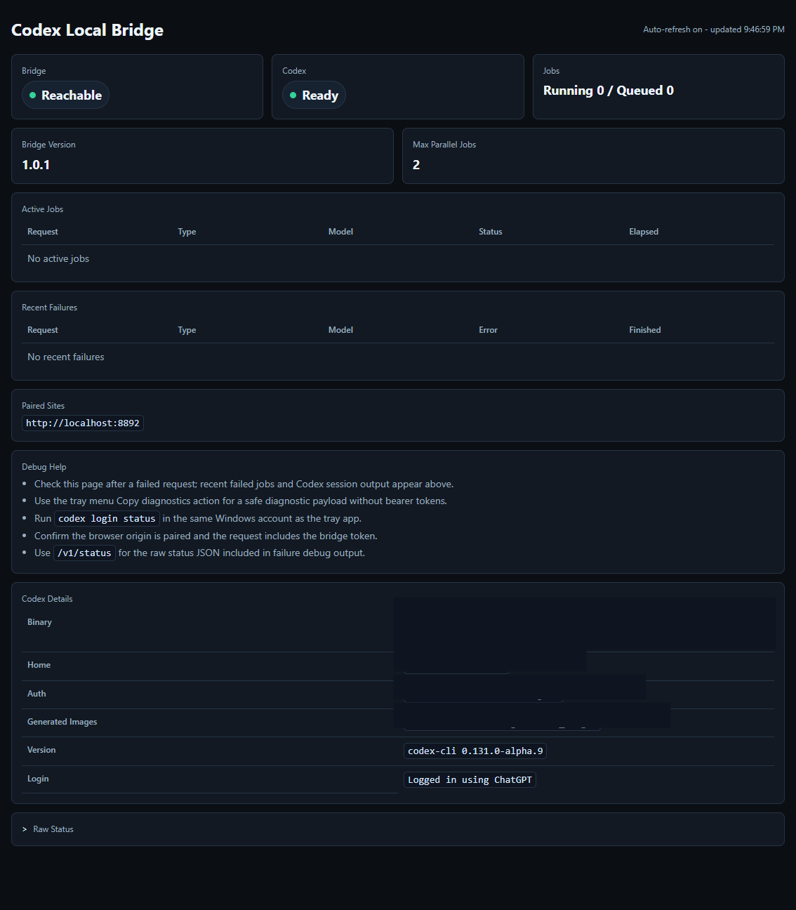

# Codex Local Bridge

Windows tray companion for Alorbach AI Subscription Gateway. It exposes a secure localhost bridge to the user's own Codex CLI login so browser-mediated WordPress chat and image generation can run through the user's local Codex/ChatGPT allowance while WordPress still owns plans, quotas, audit records, and optional Gateway fees.

## Status

- Platform: Windows desktop tray app.
- Runtime: Electron plus a local Node HTTP bridge.
- Bridge URL: `http://127.0.0.1:8765` by default.
- License: `GPL-2.0-or-later`.
- Release model: pushed `v*` tags build a Windows installer and portable ZIP.

## What It Does

- Runs as a tray app in the logged-in Windows user's session.
- Starts a local HTTP bridge bound to `127.0.0.1`.
- Pairs trusted browser origins using a six digit tray-displayed pairing code.
- Stores a per-origin bearer token in the user's bridge state directory.
- Executes signed Gateway chat jobs through local `codex exec`.
- Executes signed Gateway image jobs and returns normalized base64 image data.
- Runs local Codex jobs with bounded parallelism and queues overflow requests.
- Shows bridge status, Codex login status, paired sites, diagnostics, restart, and unpair actions in the tray menu.
- Opens a minimal local status page on tray icon double-click.

## Tray Menu


## Status Page

Double-click the tray icon or use `Open status page` to open the local status page:



## Requirements

- Windows 10 or later.
- Codex CLI installed and logged in for the same Windows account that runs the tray app.
- Node.js 20+ for development builds.
- Alorbach AI Subscription Gateway with User-owned Local Codex enabled for production WordPress usage.

Before pairing, log in to Codex in the same Windows account:

```powershell
codex login
```

## Install From Release

1. Open the latest release at <https://github.com/alorbach/codex-local-bridge/releases>.
2. Download either the Windows installer `.exe` or portable `.zip`.
3. Start `Codex Local Bridge`.
4. Open the tray menu and confirm `Codex: Ready`.
5. In WordPress, enable `AI Gateway -> Settings -> Providers / Import -> User-owned local Codex`.
6. Keep the bridge URL as `http://127.0.0.1:8765` unless a custom port is required.
7. Choose a Local Codex model such as `codex-local:auto` or `codex-local:image`.
8. Enter the pairing code shown in the tray app when WordPress prompts for it.

## Documentation

- [Architecture](docs/architecture.md)
- [Local Bridge API](docs/local-bridge-api.md)
- [Gateway Integration](docs/gateway-integration.md)
- [Operations](docs/operations.md)
- [Standalone HTTP example](examples/http-app/README.md)

The Gateway-side reference implementation is in the [Alorbach AI Subscription Gateway](https://github.com/alorbach/alorbach-ai-subscription-gateway/) WordPress plugin:

```text
https://github.com/alorbach/alorbach-ai-subscription-gateway/blob/main/wordpress-plugin/includes/class-local-codex-bridge.php
https://github.com/alorbach/alorbach-ai-subscription-gateway/blob/main/wordpress-plugin/assets/js/demo-pages.js
```

## Local Development

Install dependencies:

```powershell
npm ci
```

Run the tray app:

```powershell
npm start
```

Run the local bridge without Electron:

```powershell
npm run serve
```

Run the standalone developer HTTP example:

```powershell
npm run example:http
```

Then open:

```text
http://127.0.0.1:8787
```

Run checks:

```powershell
npm test
npm run smoke
```

## Bridge API Summary

Default base URL:

```text
http://127.0.0.1:8765
```

Routes:

- `GET /status`: minimal visual bridge status page.
- `GET /v1/status`: local bridge and Codex readiness.
- `POST /v1/pair`: exchange tray pairing code for an origin token.
- `POST /v1/unpair`: remove the pairing for the request origin.
- `GET /v1/models`: list paired local model IDs.
- `POST /v1/chat`: run a signed chat job.
- `POST /v1/images`: run a signed image job.

Paired routes require:

```http
Origin: <paired-browser-origin>
X-Alorbach-Bridge-Token: <pairing-token>
X-Alorbach-Request-Id: <request-id>
```

Execution routes require a JSON envelope containing:

```json
{
  "job_token": "...",
  "request_hash": "...",
  "request_id": "...",
  "payload": {}
}
```

In production, these values come from WordPress Gateway. The bridge checks that they are present, executes Codex, and returns the result to the browser. WordPress validates the one-time token and request hash when the browser completes the job.

`GET /v1/status` also includes current local job activity:

```json
{
  "jobs": {
    "running_count": 1,
    "queued_count": 0,
    "max_concurrent": 2,
    "active": [
      {
        "request_id": "request-123",
        "short_request_id": "request-123",
        "type": "chat",
        "model": "codex-local:auto",
        "status": "running",
        "elapsed_ms": 1200
      }
    ]
  }
}
```

The `/status` page auto-refreshes and shows bounded live Codex session output for running jobs. Failed bridge requests include a `debug_help` object with the request id when available, links to `/status` and `/v1/status`, and safe troubleshooting checks. Recent failed jobs keep bounded Codex session output such as stderr/stdout/last response text when available.

## Security Model

- The bridge binds only to `127.0.0.1`.
- Non-localhost socket clients are rejected.
- Browser origins must be paired before model and execution routes are accepted.
- Pairing tokens are per origin and stored in `%USERPROFILE%\.alorbach-codex-bridge\state.json`.
- The tray diagnostics omit bearer token values.
- Requests have a 12 MiB JSON body limit.
- Codex runs in ephemeral temp directories for bridge jobs.
- Production accounting and duplicate protection stay in WordPress Gateway, not in the local tray app.

## Runtime Configuration

- `ALORBACH_CODEX_BRIDGE_PORT`: bridge port. Default: `8765`.
- `ALORBACH_CODEX_BINARY`: explicit path to `codex.exe` or another Codex executable.
- `CODEX_HOME`: Codex profile directory. Default: `%USERPROFILE%\.codex`.
- `ALORBACH_CODEX_MAX_CONCURRENT_JOBS`: maximum parallel local Codex jobs. Default: `2`.
- `ALORBACH_CODEX_CHAT_TIMEOUT_MS`: chat timeout. Default: `600000`.
- `ALORBACH_CODEX_IMAGE_TIMEOUT_MS`: image timeout. Default: `1800000`.

If Windows resolves `codex` to a problematic `.cmd` shim, set `ALORBACH_CODEX_BINARY` to the real executable path before starting the bridge.

## Build Windows Artifacts

```powershell
npm ci
npm run dist:win
```

Build output is written to `dist/` and includes build-numbered artifacts:

```text
Codex-Local-Bridge-1.0.1-build.42-win-x64.exe
Codex-Local-Bridge-1.0.1-build.42-win-x64.zip
```

Local builds increment `.build/build-number`. GitHub Actions builds use `GITHUB_RUN_NUMBER`.

## Release

Push a version tag to build and publish release assets:

```powershell
git tag v1.0.1
git push origin v1.0.1
```

The release workflow runs icon generation, JavaScript syntax checks, tests, and Windows packaging before uploading the installer and portable ZIP to a GitHub Release. It also generates the release description automatically with download names, validation context, and GitHub's generated change entries for the tag.

## License

GPL-2.0-or-later
